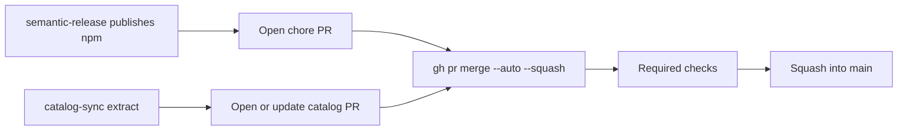

# Auto-merge catalog and manifest sync PRs

Status: approved (2026-08-28)
**Branch:** `feature/2026-08-28-auto-merge-sync-prs`

## Goal

Bot-opened catalog refresh PRs and post-release `chore/manifest-sync-v*` PRs merge themselves after required CI is green. A human should not have to squash-merge them so `package.json` / `manifest.json` on `main` lag behind the npm tag.

## Locked (do not reopen)

- `main` stays protected. Bots still open PRs; they do not push commits onto `main`.
- Merge method stays squash + delete source branch (repo default).
- npm publish is unchanged: semantic-release still writes `0.x.y` into the tarball before publish. The chore PR only copies that version onto git.
- Path-gated releases stay: this change is CI/scripts/docs only and must not cut an npm version.
- Do not fold this package into workit.

## Requirements

- G1: Repo setting **Allow auto-merge** is on (`allow_auto_merge: true`). Without it, `gh pr merge --auto` cannot queue merge-when-green.
- G2: After opening `chore/manifest-sync-v*`, the release job queues auto-merge. If queueing fails, the job **fails** (no `|| echo` swallow).
- G3: After opening or updating `chore/catalog-sync`, catalog-sync CI queues the same auto-merge. Failure fails the job.
- G4: Required checks stay `check (test|typecheck|pack|lint|format)`. Auto-merge waits for those; it does not skip them.

## Non-goals

- Bypassing branch protection or required status checks.
- Auto-merging human feature PRs.
- Changing semantic-release so it commits version bumps to `main` directly.

## Constraints / Architecture

`gh pr merge --auto` at PR-create time is the queue. GitHub merges once checks pass. The repo must have Allow auto-merge enabled (set via API; not a file in git).
