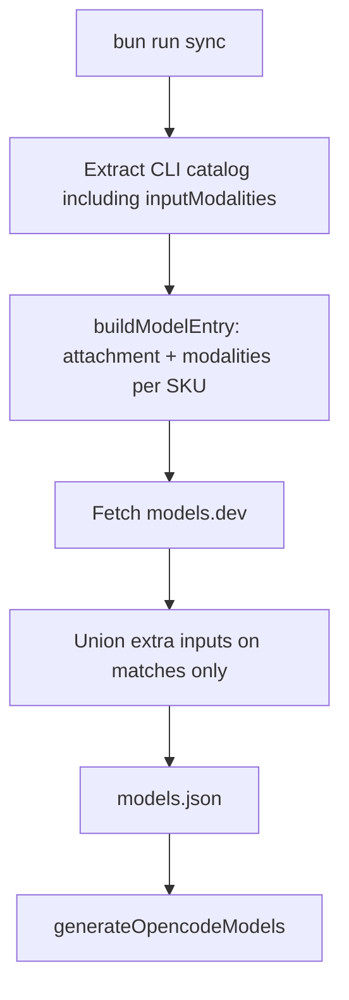

# Spec: Catalog modalities from Command Code CLI

Status: approved (2026-08-28)
**Branch:** `feature/2026-08-28-catalog-modalities`

Parent: [docs/2026-08-28-ci-catalog/spec.md](../2026-08-28-ci-catalog/spec.md)

## Goals

- G1: Every Command Code SKU in the bundled catalog carries OpenCode `attachment` and `modalities` from the CLI catalog `inputModalities` field (same extract as ids/reasoning).
- G2: models.dev only **enriches** extra input types (`video` / `audio` / `pdf`) on matches. It never overwrites CLI vision/text-only and never invents text-only for a SKU the CLI already classified.
- G3: Cost waterfall stays independent.

## Locked (do not reopen)

- Command Code CLI catalog is the source of truth for native vision vs text-only. The public GitHub repo is a stub; the field lives on every model object in the npm `command-code` bundle as `inputModalities: ["text"]` or `["text","image"]`.
- Provider API `GET /provider/v1/models` has `context_length` only — no vision flags. Official docs Capabilities column is icons, not structured data.
- models.dev may add extra modality strings; it must not flip a CLI text-only model to vision or wipe CLI vision on unmatched ids.
- Last-resort text-only applies only when a model has **no** CLI `inputModalities` and no models.dev match (e.g. hardcoded extras).
- Runtime still does not fetch models.dev. Sync writes the fields into `models.json`.
- Do not overwrite CLI `reasoning` / `reasoningEfforts` from models.dev.
- Do not inject capability text into the session prompt.

## Context

`extractModelCatalog` already evaluates full CLI model objects. `buildModelEntry` previously dropped `inputModalities` and `maxOutputTokens`. Hy4 Preview is `["text"]` in the CLI catalog (not a missing match). Gemini 3.5 Flash is `["text","image"]`.

## Non-goals

- Session/system-prompt injection
- Local OpenCode overlay `commandcode-modalities.ts` (redundant after this ships)
- Changing hybrid Provider API transport
- Parsing the HTML Capabilities column on commandcode.ai docs

## Architecture

## Acceptance criteria

- CA-01: `buildModelEntry` maps CLI `inputModalities` including `"image"` to `attachment: true` and maps `["text"]` to text-only, including Hy4 Preview.
- CA-02: `loadCatalogFromBundle` preserves those fields from a minified CLI-shaped catalog.
- CA-03: `applyModelsDevModalities` keeps CLI vision on ids models.dev does not list.
- CA-04: models.dev may append extra inputs (e.g. Gemini `video`/`audio`/`pdf`) without removing CLI `text`/`image`.
- CA-05: `generateOpencodeModels` always emits `attachment` and `modalities`.
- CA-06: README states vision/text-only comes from the CLI catalog.

## Decisions

- D-01: CLI `inputModalities` wins over models.dev for native vision vs text-only.
- D-02: Extra modality strings from models.dev are copied, not filtered to `text`/`image`.
- D-03: `maxOutputTokens` from the CLI sets `limit.output` when present.
