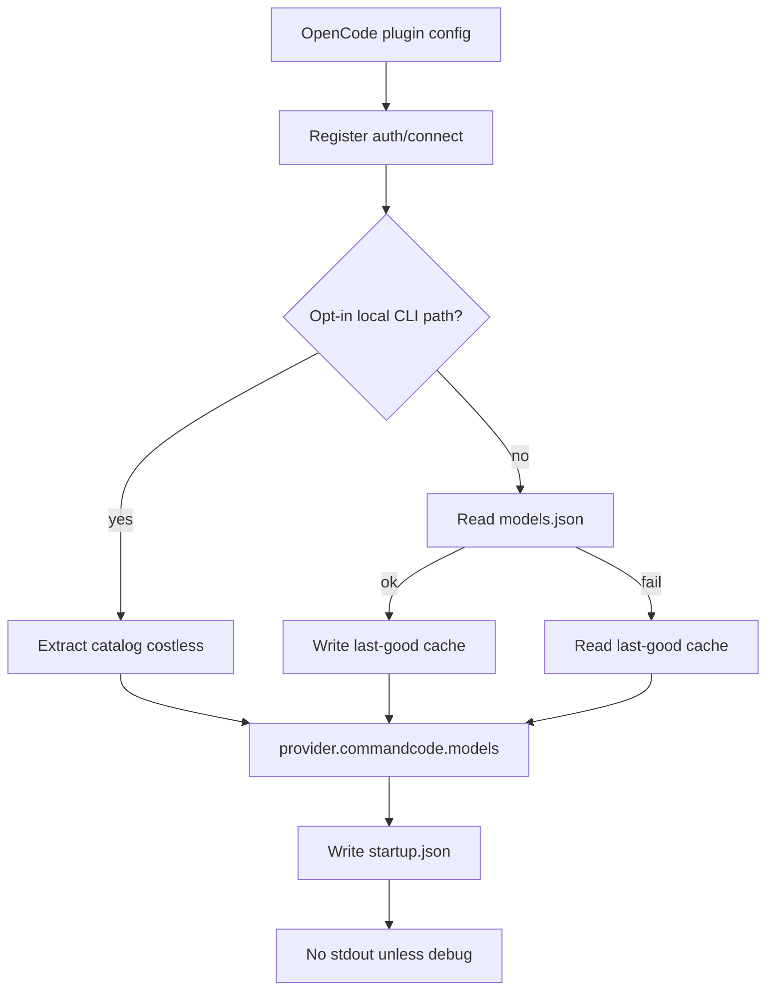
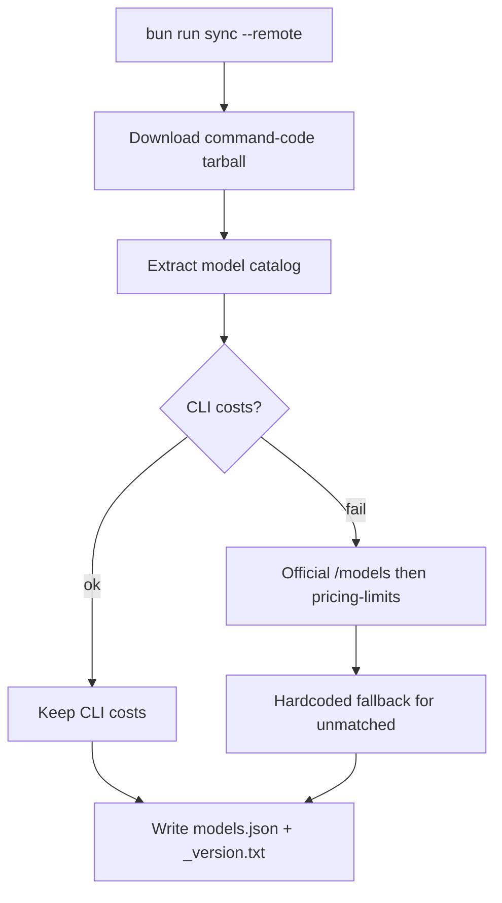

# Spec: Unblock Command Code catalog in OpenCode

**Branch:** `feature/2026-08-28-unblock-catalog`

Parent specs:
- [../specs/2026-08-19-stable-model-identity.md](../specs/2026-08-19-stable-model-identity.md)
- [../specs/2026-08-28-ci-catalog-automation.md](../specs/2026-08-28-ci-catalog-automation.md)

## Context

OpenCode cannot use the Command Code plugin reliably on current `command-code` releases. Catalog extraction returns null when CLI cost parsing fails (`command-code@1.38.0`), so the plugin falls back to a stale bundled `models.json` (`_version.txt` 1.1.0). Plugin `console.log` / `console.warn` also leak into OpenCode’s loading UI. Users should not need a local `command-code` install.

## Goals

- G1: `loadCatalogFromBundle` returns models when cost extraction throws.
- G2: Plugin `config` writes no stdout/stderr unless `debugStartupLogs` is true.
- G3: Default catalog is bundled `models.json`; local CLI scrape is opt-in only.
- G4: Auth/connect still registers if the catalog is empty.
- G5: Last-good catalog cache if bundled JSON is unreadable.
- G6: Committed `models.json` refreshed from the latest `command-code` tarball with official-docs cost fill.

## Non-goals

- GitHub Actions catalog-sync workflow and `catalog-break` issues
- npm rename/publish (`@brainervirus/commandcode-go-opencode-provider`)
- Stable identity keys, alias migration, `(new)` badges
- Third-party cost API (`COST_ENRICHMENT_API_URL`)
- Reasoning trace stream adapter
- Provider API model merge at startup

## Architecture





OpenCode loading (plugin must not add lines):

```text
┌─────────────────────────────┐
│ OpenCode                    │
│ Loading…                    │
│                             │
│ (no [commandcode] logs)     │
└─────────────────────────────┘
```

## Data flow / contracts

| Term | Meaning |
| --- | --- |
| bundled catalog | `models.json` shipped with the plugin |
| costless load | models extracted even if `extractCostData` throws |
| opt-in local | scrape local CLI only if `commandCodePackagePath` or `COMMANDCODE_PACKAGE_PATH` is set |
| billed rate | last `$` amount in a docs cell (deal-adjusted) |

Runtime never fetches prices. `bun run sync` fills costs: CLI → official docs (`https://commandcode.ai/models`, then pricing-limits) → hardcoded fallback. Exact id then exact display name.

## Acceptance criteria

- CA-01: `loadCatalogFromBundle` returns at least one model when the bundle has a model catalog and no cost map.
- CA-02: Plugin `config` does not call `console.log` or `console.warn` by default.
- CA-03: Plugin registers models from bundled `models.json` with no local `command-code` install.
- CA-04: Plugin still sets `provider.commandcode` npm/env/auth when models resolve to `{}`.
- CA-05: Unreadable `models.json` falls back to last-good cache when present.
- CA-06: `bun run sync --remote` writes `models.json` and `_version.txt` from latest tarball (not `1.1.0`).
- CA-07: Sync applies official-docs costs for models missing CLI costs; catalog write does not fail if docs parse is empty.

## Decisions

- D-01: Default runtime source is bundled JSON, not local CLI scrape.
- D-02: Diagnostics go to `~/.local/state/opencode/commandcode-provider/startup.json`.
- D-03: CI/npm publish and identity aliases wait for later plans.

## Future work

- CI catalog-sync + `catalog-break` issues
- npm publish as `@brainervirus/commandcode-go-opencode-provider`
- Stable model identity / favorites aliases
- Optional `COST_ENRICHMENT_API_URL`
